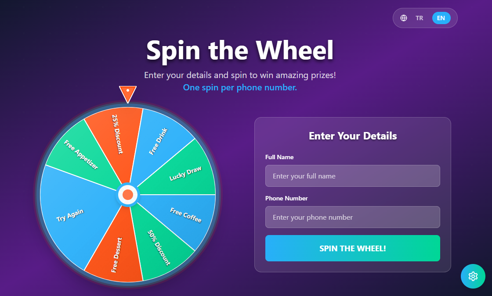

# 🎯 Promotion Wheel - Gamified Advertising Web App

A visually striking, single-page "spin-the-wheel" web application for gamified advertising promotions. Users enter their details to spin a physics-animated prize wheel, with results recorded to Google Sheets and admin configuration via a password-protected interface.



## ✨ Features

- **Physics-Animated Wheel**: Smooth acceleration and deceleration with realistic spin mechanics
- **Phone Validation**: 11+ digit validation with duplicate prevention
- **Admin Configuration**: Password-protected settings to manage prizes and probabilities
- **Google Sheets Integration**: Automatic result recording and configuration storage
- **Responsive Design**: Works perfectly on desktop and mobile devices
- **Confetti Effects**: Celebratory animations on winning
- **Modern UI**: Glassmorphism design with neon accents and smooth animations

## 🏗️ Architecture

### Frontend
- **React + TypeScript + Vite**: Modern development stack
- **TailwindCSS**: Utility-first styling with custom animations
- **Framer Motion**: Smooth animations and micro-interactions
- **React Query**: Server state management
- **Canvas Confetti**: Celebration effects

### Backend
- **Cloudflare Pages Functions**: Lightweight serverless functions
- **Google Sheets API**: Direct integration (no Apps Script needed)
- **No Traditional Backend**: Fully serverless architecture

### Data Flow
```
Client → Cloudflare Pages Function → Google Sheets API → Google Sheets
```

## 🚀 Quick Start

### Prerequisites
- Node.js 18+ and npm
- Google account for Sheets API
- Cloudflare account for hosting

### 1. Clone and Install
```bash
git clone <repository-url>
cd promotion-wheel
npm install
```

### 2. Environment Setup
Copy `env.example` to `.env` and configure:

```bash
cp env.example .env
```

Edit `.env`:
```env
# Public variables (exposed to client)
PUBLIC_WHEEL_SLICES=[{"label":"Prize 1","weight":1},{"label":"Prize 2","weight":1}]

# Server-only variables (Cloudflare Pages Functions)
ADMIN_PASSWORD_HASH=$2a$10$your.bcrypt.hash.here
GOOGLE_SHEETS_ID=your_google_sheet_id_here
GOOGLE_SHEETS_API_KEY=your_google_sheets_api_key_here
ALLOWED_ORIGIN=https://your-domain.pages.dev
```

### 3. Generate Admin Password Hash
```bash
node -e "const bcrypt = require('bcryptjs'); console.log(bcrypt.hashSync('your-password', 10));"
```

### 4. Google Sheets Setup

1. Go to [Google Sheets](https://sheets.google.com)
2. Create a new spreadsheet named "Promotion Wheel Results"
3. Set up the sheet structure:
   - A1: `Timestamp`
   - B1: `FullName`
   - C1: `Phone`
   - D1: `Prize`
4. Rename the sheet tab to "Results"
5. Share the sheet with "Anyone with the link can edit"
6. Get your Google Sheets API key:
   - Go to [Google Cloud Console](https://console.cloud.google.com)
   - Enable Google Sheets API
   - Create an API key
   - Copy the Sheet ID from the URL and API key to your `.env` file

### 5. Development
```bash
npm run dev
```

Visit `http://localhost:3000` to see the app.

### 6. Deploy to Cloudflare Pages

1. Push your code to a Git repository
2. Connect your repository to Cloudflare Pages
3. Set build settings:
   - Build command: `npm run build`
   - Build output directory: `dist`
4. Add environment variables in Cloudflare Pages dashboard:
   - `ADMIN_PASSWORD_HASH`
   - `GOOGLE_SHEETS_ID`
   - `GOOGLE_SHEETS_API_KEY`
   - `ALLOWED_ORIGIN` (your Pages domain)
5. Deploy!

## 📁 Project Structure

```
promotion-wheel/
├── src/
│   ├── components/          # React components
│   │   ├── Wheel.tsx       # Main wheel component
│   │   ├── SpinForm.tsx    # User input form
│   │   ├── ResultModal.tsx # Win result display
│   │   ├── AdminModal.tsx  # Admin configuration
│   │   └── Toast.tsx       # Notifications
│   ├── hooks/              # Custom React hooks
│   │   ├── useWheel.ts     # Wheel animation logic
│   │   └── useConfetti.ts  # Confetti effects
│   ├── utils/              # Utility functions
│   │   ├── validation.ts   # Form validation
│   │   ├── wheel.ts        # Wheel calculations
│   │   └── api.ts          # API client
│   ├── types/              # TypeScript types
│   └── App.tsx             # Main app component
├── functions/              # Cloudflare Pages Functions
│   └── api/               # API endpoints
├── public/                # Static assets
└── dist/                  # Build output
```

## 🎮 How It Works

### User Flow
1. User enters name and phone number
2. System checks if phone number already exists
3. If valid, user spins the wheel
4. Wheel animates with physics-based movement
5. Result is displayed with confetti effect
6. Result is recorded to Google Sheets

### Admin Flow
1. Admin clicks gear icon (bottom-right)
2. Enters password for authentication
3. Configures wheel slices (prizes and weights)
4. Saves configuration to localStorage
5. Changes apply immediately

### Wheel Physics
- **Weighted Random Selection**: Each slice has a probability weight
- **Smooth Animation**: Cubic easing for realistic deceleration
- **Multiple Rotations**: 3-8 full turns before stopping
- **Precise Landing**: Calculated target angle with small random jitter

## 🔧 Configuration

### Wheel Slices
Configure prizes and their probabilities in the admin panel:
- **Label**: Prize name (e.g., "Free Coffee", "50% Discount")
- **Weight**: Probability weight (higher = more likely to win)

### Phone Validation
- Minimum 11 digits
- Must not be all identical digits
- Duplicate prevention via Google Sheets

### Security Features
- Admin password hashed with bcrypt
- Server-side validation for all operations
- CORS protection
- Rate limiting (configurable in Pages Functions)

## 📊 Google Sheets Structure

### Results Sheet
| Timestamp | FullName | Phone | Prize |
|-----------|----------|-------|-------|
| 2024-01-01T10:00:00Z | John Doe | 1234567890 | Free Coffee |

### Settings Storage
- **localStorage**: App settings stored in browser
- **Persistent**: Survives page refreshes
- **Admin managed**: Only admins can modify
- **Default fallback**: Loads defaults if no settings found

## 🎨 Customization

### Styling
- Modify `tailwind.config.js` for color schemes
- Update `src/index.css` for global styles
- Customize component styles in individual files

### Wheel Appearance
- Adjust colors in `src/components/Wheel.tsx`
- Modify size and animations in wheel component
- Change confetti effects in `src/hooks/useConfetti.ts`

### Validation Rules
- Update validation schemas in `src/utils/validation.ts`
- Modify phone number requirements
- Add custom validation rules

## 🚨 Security Considerations

1. **Never expose secrets to client**: All sensitive data stays in Pages Functions
2. **Validate server-side**: All inputs validated on the server
3. **Rate limiting**: Implement rate limiting for spin attempts
4. **CORS protection**: Restrict origins to your domain
5. **Password security**: Use strong bcrypt hashes for admin passwords

## 🐛 Troubleshooting

### Common Issues

**Wheel not spinning:**
- Check browser console for JavaScript errors
- Verify wheel configuration is loaded
- Ensure all dependencies are installed

**Google Sheets not updating:**
- Verify Apps Script web app URL is correct
- Check Apps Script execution logs
- Ensure proper permissions are set

**Admin login failing:**
- Verify password hash is correctly generated
- Check Pages Function logs
- Ensure environment variables are set

**CORS errors:**
- Verify `ALLOWED_ORIGIN` is set correctly
- Check that your domain matches the allowed origin

### Debug Mode
Enable debug logging by adding to your environment:
```env
DEBUG=true
```

## 📈 Performance Optimization

- **Lazy Loading**: Components load on demand
- **Image Optimization**: Optimize any images used
- **Bundle Splitting**: Vite automatically splits bundles
- **Caching**: React Query handles API caching
- **CDN**: Cloudflare provides global CDN

## 🔄 Updates and Maintenance

### Regular Tasks
1. Monitor Google Sheets quota usage
2. Review and rotate admin passwords
3. Check Cloudflare Pages function logs
4. Update dependencies regularly

### Scaling Considerations
- Google Sheets has row limits (10M cells)
- Consider migrating to database for high volume
- Implement proper rate limiting
- Add monitoring and alerting

## 📄 License

This project is licensed under the MIT License - see the LICENSE file for details.

## 🤝 Contributing

1. Fork the repository
2. Create a feature branch
3. Make your changes
4. Add tests if applicable
5. Submit a pull request

## 📞 Support

For issues and questions:
1. Check the troubleshooting section
2. Review the GitHub issues
3. Create a new issue with detailed information

---

**Built with ❤️ for gamified advertising promotions**

